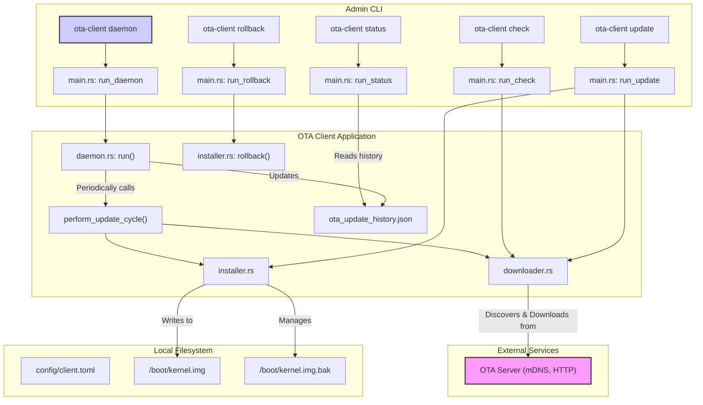

# OTA (Over-The-Air) Update Client

A robust, resilient client for managing and applying firmware/kernel updates on IoT devices. This client operates as a background service (daemon), periodically checking a central OTA server for new updates, downloading them, and applying them securely.

---

## ✨ Features

- **Background Daemon**: Runs as a `systemd` service, ensuring continuous operation.
- **mDNS Service Discovery**: Automatically discovers the OTA server on the local network, eliminating static configuration.
- **Resilient Updates**: Includes retry logic with exponential backoff for network operations.
- **Atomic Installation**: Ensures that the device is not left in a broken state if an update fails.
- **Automatic Rollback**: Can automatically revert to the previous working version if an update fails catastrophically.
- **Checksum Verification**: Validates the integrity of downloaded files.
- **Detailed Status & History**: Provides CLI commands to check the client's status and review update history.

---

## 📂 Project Structure

The project is organized into several modules, each with a specific responsibility:

| Module           | Description                                                                                              |
| ---------------- | -------------------------------------------------------------------------------------------------------- |
| `main.rs`        | The main entry point. Parses CLI commands and dispatches to the appropriate logic (e.g., run daemon, check status). |
| `daemon.rs`      | Implements the core background service that orchestrates the entire update lifecycle.                      |
| `config.rs`      | Manages client configuration, loading settings from a `client.toml` file.                                |
| `downloader.rs`  | Handles mDNS server discovery, version checks, and secure file downloads.                                |
| `installer.rs`   | Manages the installation of new kernels, including creating backups and performing rollbacks.            |
| `types.rs`       | Defines shared data structures, enums, and command-line arguments using `clap` and `serde`.             |
| `lib.rs`         | The main library crate.                                                                                  |

---

## 🌊 Control Flow

There are two primary workflows: the **Daemon Flow** (the background update process) and the **Admin Flow** (for managing the client via the CLI).

### 1. Daemon Flow (Background Service)

This is the client's main operational mode, running automatically in the background.

1.  **Daemon Start**: The service is started (typically by `systemd`) via the `ota-client daemon` command.
2.  **Initialization**: The `OtaDaemon` instance is created, loading configuration and past update history.
3.  **Periodic Check**: The daemon enters a loop, waking up periodically based on the configured check interval.
4.  **Server Discovery**: It uses mDNS to find the OTA update server on the local network.
5.  **Version Check**: It queries the server's `/version` endpoint to see if a new version is available.
6.  **Download & Verify**: If an update is found, it downloads the kernel file, showing progress and verifying its checksum.
7.  **Installation**: The `Installer` takes over, backing up the current kernel and installing the new one.
8.  **Record Update**: The result of the operation (success or failure) is logged to `ota_update_history.json`.
9.  **Error Handling**: If any step fails, it retries with backoff. On critical failure, it may trigger an automatic rollback.

### 2. Admin Flow (CLI)

An administrator can interact with the client using the command line.

-   **`ota-client check`**: Manually triggers a single check for an update.
-   **`ota-client update`**: Forces an update attempt if one is available.
-   **`ota-client status`**: Displays the current configuration, daemon state, and recent update history.
-   **`ota-client rollback`**: Manually triggers a rollback to the previous version.

### Architecture Diagram

The following diagram visualizes the interaction between the different components:



---

## ⚙️ Configuration

The client is configured using the `config/client.toml` file.

```toml
# config/client.toml

# Interval in minutes to check for updates
check_interval_minutes = 60

# Temporary path for downloading kernel files
download_path = "/tmp/ota"

# Path to the active kernel file
kernel_path = "/boot/vmlinuz"

# Path to store the backup of the old kernel
backup_path = "/boot/vmlinuz.bak"

# Timeout for download operations in seconds
download_timeout_secs = 300

# mDNS service name to discover
mdns_service_name = "_ota._tcp.local"
```

---

## 🚀 Usage

### Running the Daemon

The primary way to run the client is as a service. A `systemd` service file is provided.

<pre style="background-color:#2d2d2d; color:#feda75; padding:1em; border-radius:5px;">
# Copy the service file
sudo cp systemd/ota-client.service /etc/systemd/system/

# Reload systemd, enable and start the service
sudo systemctl daemon-reload
sudo systemctl enable ota-client.service
sudo systemctl start ota-client.service
</pre>

### Manual Operations

You can also interact with the client directly from the command line.

**1. Check for an Update**

<pre style="background-color:#2d2d2d; color:#81a1c1; padding:1em; border-radius:5px;">
ota-client check --config config/client.toml
</pre>

**2. Force an Update**

<pre style="background-color:#2d2d2d; color:#81a1c1; padding:1em; border-radius:5px;">
ota-client update --config config/client.toml
</pre>

**3. View Status**

<pre style="background-color:#2d2d2d; color:#a3be8c; padding:1em; border-radius:5px;">
ota-client status --config config/client.toml
</pre>

**4. Perform a Rollback**

<pre style="background-color:#2d2d2d; color:#bf616a; padding:1em; border-radius:5px;">
ota-client rollback --config config/client.toml
</pre> 